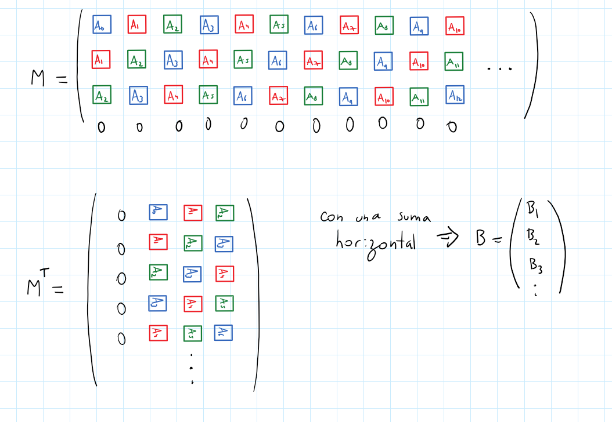

# 8.- "Vectorized Jacobi 1D Stencil" (pg 75)
La iteración de Jacobi es un metodo con gran variedad de aplicaciones. Un simple stencil de 3 puntos se puede implementar con el siguiente fragmento de codigo:

```c++
for(uint64_t t=0; t<T; t++) {
	for(uint64_t i=1; i<N-1; i++)
		B[i] = 0.33 * (A[i-1] + A[i] + A[i+1]);
	for(uint64_t i=1; i<N-1; i++)
		A[i] = B[i];
}
```
el primer loop interno realiza la computacion stencil; mientras que el segundo loop interno copia el output array en el input array para la siguiente iteración

# i) analizar las `data dependencies` en el codigo secuencial
- El codigo secuencial dependen 3 valores para cada `B[i]`
    - el anterior `A[i-1]`
    - el actual `A[i]`
    - el siguiente `A[i+1]`

# ii) propon una `data layout transformation` para realizar una vectorización eficiente del codigo
- Una transformación de como ordenamos los datos con el objetivo de realizar una vectorización eficiente:



Para transformarla en codigo resulto más facil que la primera columna fuera la de 0's, he aqui el codigo que crea directamente la M traspuesta,
pues crear M y luego trasponer es la opción clasica pero más larga.

```c
void data_transform_to_transpose(float* A, float* Mt, size_t N) {
    for(uint64_t k = 1; k < 4; k++) {
        for(uint64_t i=0; (i+k-1)<N; i++) {
            Mt[i*4 + k] = A[i+k-1];
    }}
}
```


# iii) que intrinsics son necesarias para tu implementación de vectorización

Ya que tenemos 4, es más util utilizar las intrinsics de la familia de 128 bits; de manera que trabajemos con 4 floats de 32 bits.

Ahora al tener M escrito de la forma:

```
0.000000 0.000000 1.000000 2.000000
0.000000 1.000000 2.000000 3.000000
0.000000 2.000000 3.000000 4.000000
0.000000 3.000000 4.000000 5.000000
0.000000 4.000000 5.000000 6.000000
0.000000 5.000000 6.000000 7.000000
0.000000 6.000000 7.000000 0.000000
```

Queremos sumar horizontalmente, para ello se implementó:

```c
void vectorized_horizontal_add(float* M, float*B, uint64_t N) {
	for(uint64_t i = 0; i<N-1; i++) {
            // cargamos los 4 floats de cada fila
            __m128 MV = _mm_load_ps(M+i*4);
            // sumamos horizontalmente 2 veces
            // de forma que tengamos los 4 elementos sumados
            MV = _mm_hadd_ps(MV, MV);
            MV = _mm_hadd_ps(MV, MV);

            // guarda el valor inferior en memoria
            // ss single single (floats)
            // sd single doubles 
            _mm_store_ss(B+i+1, MV);
                // i+1 pues comenzamos con B[1]
                // notar que no llenamos B[0] o B[N]
                // pues el algoritmo original no lo incluye directamente en el metodo de suma
    }
}
```

Sumanod horizontalmente M deberiamos de quedar con

```
0.000000 0.000000 1.000000 2.000000 = 3 = B[1]
0.000000 1.000000 2.000000 3.000000 = 6
0.000000 2.000000 3.000000 4.000000 = 9
0.000000 3.000000 4.000000 5.000000 = 12
0.000000 4.000000 5.000000 6.000000 = 15
0.000000 5.000000 6.000000 7.000000 = 18 = B[6]
0.000000 6.000000 7.000000 0.000000 = 13 = B[7]
```
sin embargo, se debe no incluir los casos de las esquinas, osea estos nos quedamos con los valores originales de A:

```
B[0] = 
```

Cosa que se consigue 


Tenemos así la comparasión de Tiempos del codigo en `t3_jacobistencil.c`

```bash
$ Clase10_Tarea/ gcc .\t3_jacobistencil.c -o 3_jacobi.exe -march=skylake
$ Clase10_Tarea/ .\3_jacobi.exe
A:
0.000000 1.000000 2.000000 3.000000
4.000000 5.000000 6.000000 7.000000


Stencil Lineal     ---------------- 
B:
0.000000 0.990000 1.980000 2.970000
3.960000 4.950000 5.940000 7.000000

        runtime: 0.002000 [s]

Jacobi Vectorizado ----------------

Mt:
0.000000 0.000000 1.000000 2.000000 
0.000000 1.000000 2.000000 3.000000
0.000000 2.000000 3.000000 4.000000
0.000000 3.000000 4.000000 5.000000 
0.000000 4.000000 5.000000 6.000000
0.000000 5.000000 6.000000 7.000000
0.000000 6.000000 7.000000 0.000000 
0.000000 7.000000 0.000000 0.000000


B:
0.000000 0.990000 1.980000 2.970000
3.960000 4.950000 5.940000 7.000000 


        runtime: 0.049000 [s]
Comparasion de tiempos: 0.040816
```

Debido a la gran cantidad de pasos extra, esto no es más rapido,
solo se trata de un ejercicio de implementación de vectorización.