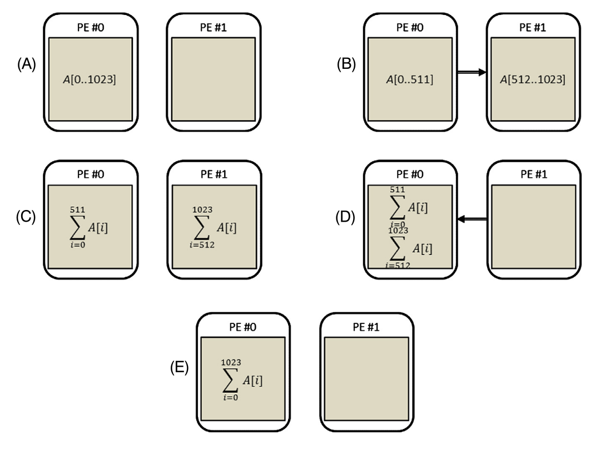
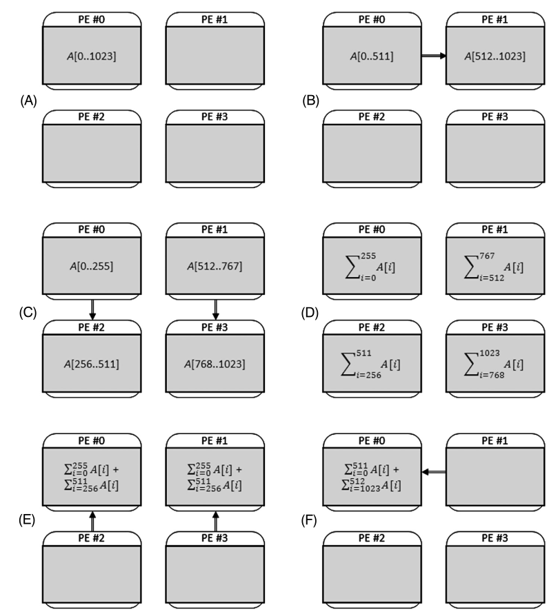
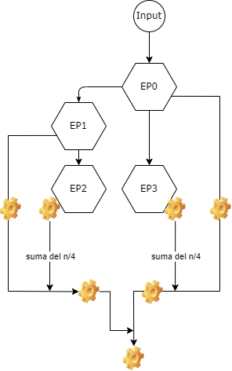
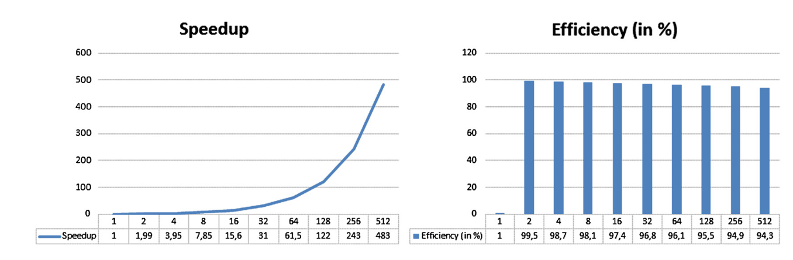

# Clase 3

- `_.cpp` es una plantilla de codigo que incluye la importacion de las libreria usadas en el curso hasta esta clase
- `README.md` es el presente archivo, contiene notas y resumen de la clase


# Instalacion de Kosmos
... se deja para otra clase


# Ejemplo simple:
Calcular la suma de un arreglo;

$$
\sum_{i=0}^{N-1} A[i]
$$

en p elementos de procesamiento (EP).
existen ciertas simplificaciones como el tiempo (no general):
- computo: 1t
- comunicar un EP a otro EP: 3t
- sincronizacion: todos los EP calculan o todos comunican

tipicamente enviar datos no toma lineal; la comunicacion es mucho mas demorosa que el computo
asi que dependera de los datos y escalara enormemente.

____

# Analisis de Escalabilidad Fuerte

Tengamos un codigo secuencial, calcular la suma de N numeros, en N-1 unidades de tiempo

$$
T(p=1, N) = N - 1
$$

## ejemplo con 2 procesadores
Para simplificar los calculos supongase que $N = 2^k$; tengamos este codigo paralelo en 2 procesadores (p=2)



- EP#0 manda la mitad del array el EP#1: 3[t] (3 unidades de tiempo)
- Cada EP calcula su suma partical de n/2 elementos: n/2 - 1 [t]
- EP#1 enviaresultado a EP#0: 3[t]
- EP#0 suma las dos sumas parciales: 1[t]

- El tiempo total seria 

$$
T(p=2, n) = 3 + n/2 -1 +3 + 1 = 6 + n/2
$$

para $n=1024$, $T(2, 1024) = 518$

el speed up sera:

$$
S(p) = \frac{T(p=1, n)}{ T(p=2, n) } = \frac{1024-1}{518} = 1.975
$$

sin embargo nunca lograriamos el speed up de 2, debido al $+6$ producto de la comunicacion.

La eficiencia (recordemos que la eficiencia es speed up por procesador) para tener dos procesadores sera de:

$$
E(p) = \frac{S(p)}{p} = \frac{1.975}{2}=98.75 \%
$$

## ejemplo con 4 procesadores






- EP#0 manda la mitad del array el EP#1: 3[t]
- EP#0 y EP#1 envian cada uno un cuarto del array al EP#2 y EP#3: 3[t]
- Cada EP calcula la uma parcial: n-4 -1 [t] (represrntado por los engranajes)
- EP#2 y EP#3 envian sus sumas parciales a EP#1 y EP#0: 3t
- EP#1 y EP#0 calculan las sumas parciales (sumar dos numeros): 1t
- EP#1 envia el resultado a EP#0: 3t
- y EP#0  lo suma con su registro, una ultima vez: 1t

$T(p=4,n) = 3 +3 + n/4 -1 + 3 + 1+ 3 + 1$
para $n=1024$; $T(4,1024) = 269$,

el speed up para $p=4$ sera:

$$
S(p) = \frac{T(p=1, n=1024)}{ T(p=4, n=1024) } = \frac{1024 - 1}{269} = 3.803
$$

y la eficiencia
$$
E(p=4) = \frac{S(p)}{p} = \frac{3.803}{4}=95.07 \%
$$

notese como la eficiencia es cada vez menor


Es posible hacer este mismo analisis con 8 procesadores y asi en general:

## $p = 2^q$ procesadores
- tiempo distribucion de los datos: $3 \log_2{2^q} = 3q$
- computo de sumas locales: $n/p - 1 = 2^{k-q} - 1$
- recopilacion resultados parciales: $3 \log_2{2^q} = 3q$
- suma de resultados parciales: q

$$
T(p,n) = 2^{k-q} - 1 + 7q
$$

luego que sucede si $p \lt \lt n \rightarrow k \gt \gt q$ el termino que viene de computo domina $2^{k-q}$

y en el otro caso, 
domina el termino $7q$

asi granficando la escalabilidad del algoritmo:


- la eficiencia es muy baja a varios procesadores
- el costo de la computacion aumenta

-> *por tanto el algoritmo no tiene escalabilidad fuerte*
osea que al mantener la misma cantidad de datos, la eficiencia se reduce.

___

# Analisis de Escalabilidad Debil
Que ocurre al aumentar el numero de elemenos del array asi como tambien aumentamos el numero de procesadores



(insertar grafico speedup, efficiency)

es posible que este algoritmo demore la misma cantidad al tener mas datos, pero nos permite observar como aumenta al aumentar la cantidad de datos.

___

# Generalizacion
- $a \gt 0$ tiempo de computo (previamente asumimos =1)
- $b \gt 0$ tiempo de comunicacion (prev. =3)

$$
T_{a, b}
$$

## Razon de computo a comunicacion
Lo que tendremos sera:
$$
S_{a,b} (p, N) = \frac{a (N-1)}{b2 \log_2{p} + a( N/p - 1 + \log_2 p )}
$$
donde:
- $a (N-1)$ proviene de computar la suma directamente
- $b\, 2 log_2 p$ proviene de separar binariamente los datos en los procesadores $b \log_2 p$ y luego reunirlos $+b \log_2 p$, notar el $b$ del costo de comunicacion
- $a (N/p - 1) $ es la computacion del array dividio en $p$ procesadores
- $a \, \log_2 p$ proviene de sumar los resultados parciales al rearmar la suma total con las sumas parciales comunicadas

Si es que usamos $\gamma = a/b$, podemos ver el comportamiento de tener mucho coste de comunicacion $b >> a \to \lim_{\gamma \to 0}$

reescribiendo en $\gamma$ obtenemos:
$$
S_{\gamma} (p, N) = \frac{\gamma (N-1)}{2 \log_2{p} + \gamma( N/p - 1 + \log_2 p )}
$$

Y al expresar como potencias de 2 la cantidad de datos, los logaritmos se simplifican bastante
- $N = 2^k$ datos
- $p = 2^q$ procesadores


$$
S_{\gamma} (2^q, 2^k) = \frac{\gamma(2^k - 1)}{2q + \gamma (2^{k-q}-1 +q)}
$$

$\gamma = a/b$, en el limite $\gamma \to 0$ (tiempo de comunicacion muy grande), el speed up tendera a 0, 

$$
\lim_{\gamma \to 0} S_{\gamma} (2^q, 2^k) = 0
$$

pues eso es que no ganariamos mucho paralelizando el algoritmo, pues todo el tiempo lo gastariamos en comunicacion.

Es posible realizar un analisis, simpliquiemos con funciones:
- $A(k) = 2^k - 1 = N-1$, donde $aA(k)$ es el coste de sumar el array completo
- $B(q,k) = 2^{k-q}-1+q =  N/p - 1 + \log_2 p$, donde $a B(q,k)$ es el coste computacional, de hacer sumas parciales y sumas estas sumas parciales
- recordemos que $b \, 2q$ es el coste de comunicacion

$$
S_\gamma (q,k) = \frac{\gamma A(k)}{ 2q + \gamma B(q,k)} =\frac{a A(k)}{b 2q + a B(q,k)}
$$

asi tomando la derivada para buscar maximos o minimos
$$
\frac{d}{d\gamma} S_\gamma(2^q, 2^k) = \frac{2q A}{(2q + \gamma B)^2}>0
$$

- osea que cuando tengamos una reduccion de gamma tendremos menos speedup
-> quiere decir que a mayor tiempo de comunicacion, menos speed up


Aplicando el ejemplo en otro caso, dado que no estuvieramos sumando pero otra operacion costosa computacionalmente

$$
\frac{d}{d\gamma} S_\gamma(p, N) >0
$$
- Asi como al reves, observamos que si nuestro algoritmo fuera muy costoso $a>>0$ entonces $\gamma$ aumentaria, por lo que tendriamos un aumento del speed up

## Speed up maximo
Calculando el maximo del speedup en funcion de q, podemos encontrar el speed up optimo resolviendo cuando ocurre el maximo.

$$
\frac{d}{d\gamma} S_\gamma(2^q, 2^k) = 0 \rightarrow  2 +\gamma-\gamma 2^{k-q}\ln 2=0
$$
despejando:
$$
2^q = \frac{\gamma \ln 2}{2 + \gamma}2 ^k \Rightarrow p =\frac{\gamma \ln 2}{2 + \gamma} N 
$$
vemos asi cuantos procesadores nos entregan el speed up maximo dada la cantidad de datos $N$ y el ratio de computacion comunicacion $\gamma$

Ejemplo
- para $\gamma=1/3$ osea que comunicar es el triple del tiempo que computar
- $N=1024$

entonces el speed up optimo se lograria con $p \approx 100$


## Conclusiones

- existe un limite de cuantos procesadores nos entregan buenos resultados, usar demasiados conlleva a que se vuelva mas lento
- el speed up optimo deende mucho de $\gamma$, pues si el tiempo de comunicacion es muy grande, sera mejor utilizar menos EP (menos procesadores)

___

# Memoria Distribuida Compartida
Volvemos a estudiar la arquitectura de los computadores,

(esquematica de memoria distribuida)

Los intercambios de datos se pueden hacer con la libreria OpenMP

### Debemos de manejar muy bien:
- Algoritmo a utilizar (de mayor importancia)
- Particion de los datos (y como comunicarlo a los procesadores)
- que calculos requieren comunicacion entre procesadores


#### Ejemplo: Ecuacion de Poisson
$$
\nabla^2 \phi = \rho()
$$

cuando tenemos diferencias finitas y queremos calcular la ecuacion de Poisson; los datos corresponderan a aun array de valores

$$
\Delta \phi = \phi_{xx} + \phi_{yy} = \frac{u(x-h,y) - 2u(x,y) + u(x+h, y)}{h^2} + \frac{u(x,y-h) - 2u(x,y) + u(x, y+h)}{h^2}
$$

*el calculo dependera de los puntos vecinos*, 
...

___

# Paralelismo Basico: Sistema de Memoria Compartida
- el acceso de los CPU al acceso del espacio comun de la memoria (notebook con procesador multinucleo i3, i7, i5)
- cada acceso a la memoria se realiza fisicamente, es un proceso LENTO
- existe el cuello de botella de von Neumann
- es posible aliviar el problema usando `cache` (una memoria reducida pero mucho mas rapido que la memoria princial)
- el `cache` fisicamente esta junto al procesador

Tipicamente utilizaremos multithreading
- cada thread tiene su propio `stack`
- su propio `registro` (otro tipo de memoria aun mas limitado pero aun mas rapido)

### race conditions
Cuando tenemos dos hilos accediendo a la misma memoria compartida a la vez;

___

# Diseño del Algoritmo como Paralelizar
Este es un ciclo simple, pero al depender de otro elemento vuelve la iteracion dependiente de las otras iteraciones, simple, pero muy complicado de paralelizar.

```c++
// c3_2_paralelizar_suma.cpp
for (i=1; i<n; i++) {
    A[i] = A[i] + A[i+1]
}
```

- en su mayoria paralelizaremos ciclos `for`

(diagrama de paralelizar este algoritmo)

___

# Jerarquia de Memoria
A mayor nivel aumenta la cantidad de memoria pero se vuelve mas lento;

- Nivel 0: la memoria mas rapida pero limitada, el registro de la CPU
- 1: SRAMs (cache)
- 2: DRAMs (memoria principa), son los chips RAM
- 3: Disk (disco duro)
- 4: discos opticos y cinta magnetica 

Hemos de aprovechar el `cache` para acelerar el programa,
el uso de los registros no es algo que podemos controlar.

En un GPU tenemos control sobre todas las areas de memoria a diferencia de la CPU.