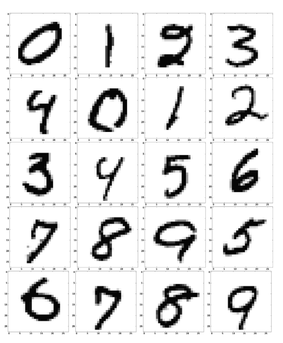

fecha: abril 24
tags: one-nearest-neighbour classifier

# Basic Parallel Reduction
Esta vez estudiamos la performance de un clasificador de vecinos cercanos (nearest neighbour classifier) entrenado con el dataset MNIST de digitos escritos a mano.


el data set se ve así:


- 65000 imagenes como arrays de $28 \times 28$ con labells de 0 a 9
- usamos 55000 para training, 10000 para testing
- toda imagen se guarda como un vector $X$ de dimension: $d = 784$ (osea se aplana el array)
- $X^{(j)} [k]$ $j$ es el index de la imagen, $k$ es el pixel de cada imagen


El clasificador define la distancia entre dos objetos para definir la similitud:

$$
\text{dist} ( X_\text{test} ^{(i)}, X_\text{train} ^{(j)}))
$$

Tiene la meta así de separar los datos en base de sus datos de entrenamiento

Funciona encontrando el objeto $j$ más similar a los vectores de entrenamiento que posee (osea que recorrera todas las posibilidades hasta encontrar el objeto más similar):

$$
j^* = \text{argmin}_j \text{dist} ( X_\text{test} ^{(i)}, X_\text{train} ^{(j)}))
$$

Lo que se desea es obtener todos los pares de la matriz de distancia $\Delta$ con forma $ m \times n$, siendo $m$ los datos de testing, $n$ los datos de entrenamiento:

$$
\Delta_{ij} = \text{dist} ( X_\text{test} ^{(i)}, X_\text{train} ^{(j)})) = \sum_{k=0}^{d-1} ( X_\text{test} ^{(i)}, X_\text{train} ^{(j)}))^2
$$

este calculo para un indice par $i,j$ tiene una complejidad de $d$;
entonces si lo hacemos para toda la matriz de distancias, la complejidad: $ \mathcal O (m \cdot d \cdot n)$
- en este problema la complejidad de memoria es $ \mathcal O (m\cdot n)$

```c
void all_vs_all(double * test, double * train, double * delta, 
          int num_test, int num_train, int num_features, bool parallel) {

    #pragma omp parallel for collapse(2) if(parallel)
    for (int i = 0; i < num_test; i++)
        for (int j = 0; j < num_train; j++) {
            double accum = 0.0;
            for (int k = 0; k < num_features; k++) {
                const double residue = test[i*num_features+k] 
                                        - train[j*num_features+k];
                accum += residue*residue;
            }
            delta[i*num_train+j] = accum;
        }
}
```

## sub temas