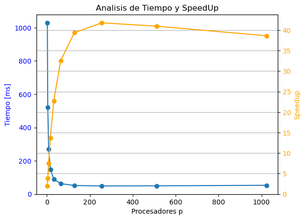
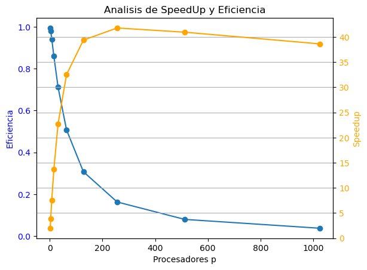

# 1.- Analiza el speed up y eficiencia
Del algoritmo de la sección 1.1, con n=2048, 
- asume que un PE puede sumar dos numeros 1 ms
- un PE puede enviar $m$ numeros en $2 + m/1024$ ms
- Varia el numero de PE de 1 a 1024 en potencias de 2

Para ver los calculos favor de revisar `Desarrollo_Tarea_1.pdf`,
encontrara que el tiempo total del algoritmo para $p$ procesadores en milisegundos $[ms]$ es de:

$$
T[N,p] = (5 + \frac{1}{2^{10}}) \log_2 p + \frac{N}{p} \{  
    (p-1) \frac{1}{2^{10}} + 1
    \} - 1
$$

Mientras que para un procesador el tiempo del algoritmo:

$$
T[N, p = 1] = N - 1 
$$

Así comparando el tiempo y el speedup:

Mientras que comparando el speed up y eficiencia:
