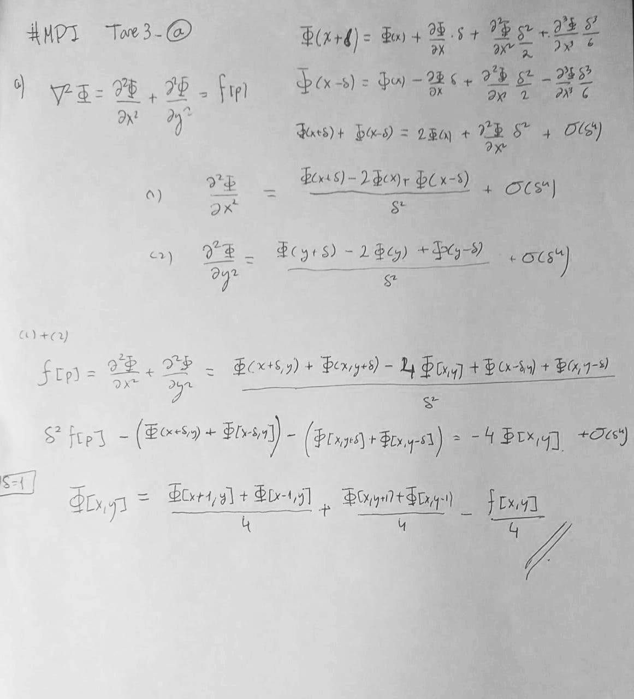
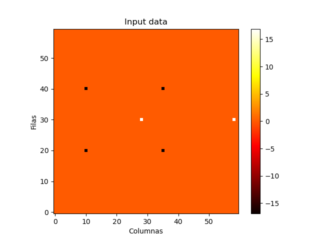
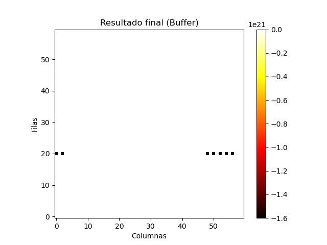

# Tarea 3
Tengase:

$$
\nabla^2 \phi = f(\vec p)
$$

La ecuación de poisson donde no hay terminos 0: $f(p)\neq 0$.

## a. Derivar una regla correspondiente para la matriz
Aqui un escan del desarrollo, pero finalmente


$$
\phi[x,y] = \frac{\phi[x+1,y] + \phi[x-1,y]}{4} + \frac{\phi[x,y+1] + \phi[x,y-1]}{4} - \frac{f[x,y]}{4}
$$

donde $f[x,y]$ se refiere a la `data`, a la densidad de los puntos en el problema.


## b. Diseñar un algoritmo de MPI que distribuye la matrix de datos en un grid de tiles bidimensional. Asegurate de utilizar `derived datatypes` para eficientemente comunicar columnas entre bloques vecinos

Para el diseño de este algoritmo tenemos que:
Primero necesitamos dividir la matriz en submatrices o tiles y asignar cada submatriz a un proceso MPI.

1. Inicialización MPI:

- MPI_Init: Inicializar MPI.
- MPI_Comm_size: Obtener el número total de procesos.
- MPI_Comm_rank: Obtener el identificador del proceso actual.

2. División de la matriz:
- Determinar el tamaño de la matriz global (filas y columnas).
- Calcular el número de bloques (submatrices) en cada dimensión.
- Calcular el tamaño de cada bloque en filas y columnas.
- Distribuir las submatrices a los procesos utilizando la función MPI_Scatterv o MPI_Cart_create (para la comunicación posterior).
- Comunicación entre bloques vecinos:

3. Crear derived datatypes que describan las columnas que deben comunicarse entre bloques vecinos.
- Utilizar las funciones MPI_Cart_shift o MPI_Send/MPI_Recv para intercambiar las columnas necesarias.

4. Cálculo local:
- Cada proceso realiza el cálculo de Jacobi iterativamente para su submatriz local utilizando la regla de actualización proporcionada.

5. Sincronización:
- Sincronizar los procesos utilizando MPI_Barrier para asegurarse de que todos los cálculos locales se completen antes de avanzar.

6. Recopilación de resultados:
- Utilizar la función MPI_Gatherv para recopilar los resultados de todas las submatrices y obtener la matriz global actualizada.

7. Finalización de MPI:
- MPI_Finalize: Terminar MPI.

`Para ver el codigo final favor de revisar "tarea3_jacobi.c`
El codigo se vería algo como:
```c
#include <stdio.h>
#include <stdlib.h>
#include "mpi.h"

// Función de actualización local de Jacobi
void updateJacobiLocal() {
    // Implementar la regla de actualización de Jacobi para la submatriz local (myData).
    // Utilizar myBuff para almacenar el resultado temporal.
    // Utilizar prevRow y nextRow para las comunicaciones con los bloques vecinos.
    // ...
}

int main(int argc, char *argv[]) {
    // Inicialización MPI
    MPI_Init(&argc, &argv);
    int numP, myID;
    MPI_Comm_size(MPI_COMM_WORLD, &numP);
    MPI_Comm_rank(MPI_COMM_WORLD, &myID);

    // Leer argumentos, distribuir datos, crear derived datatypes, etc.
    // ...

    // Bucle para iteraciones de Jacobi
    for (int iter = 0; iter < maxIter; iter++) {
        // Comunicación entre bloques vecinos utilizando derived datatypes
        // ...

        // Cálculo local utilizando la función updateJacobiLocal
        // ...

        // Sincronización entre iteraciones utilizando MPI_Barrier
        MPI_Barrier(MPI_COMM_WORLD);
    }

    // Recopilación de resultados utilizando MPI_Gatherv
    // ...

    // Finalización MPI
    MPI_Finalize();
}

```

sin embargo parezco tener un problema con como realizo las comunicaciones, pues el potencial no converge correctamente:
para graficar se escribierón scripts de python que eran rapidos de correr dentro de la terminal y se corrió el programa tal que:

```bash
mpicc -o jacobi.exe .\tarea3_jacobi.c
mpiexec -n 6 .\jacobi.exe 60 60 0.01
python .\view_data.py
```

los datos iniciales:


el potencial calculado:

como se observa se generan divergencias, he intentado realizar acciones en distinto orden pero sigo teniendo ese problema.

Para más información sobre este problema estoy utilizando mingw64 en un sistema Windows10.